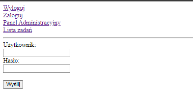
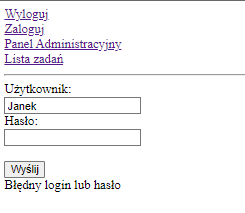
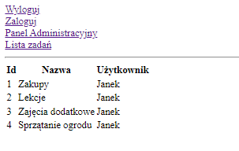
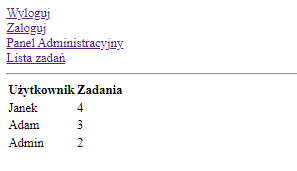
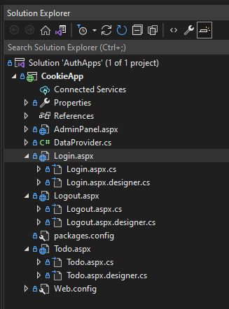
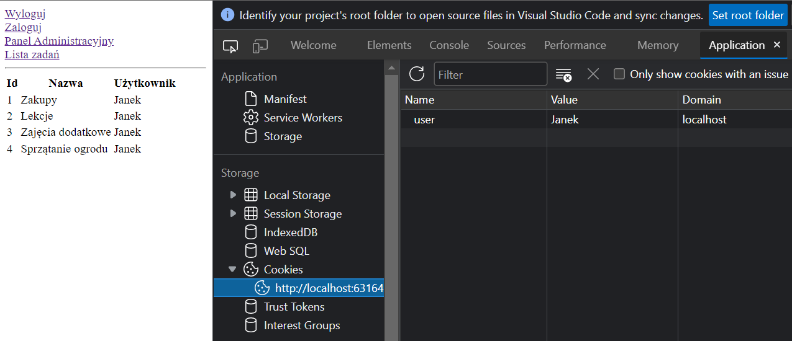

# CookieApp

 ## Logika i opis aplikacji 

   

   

  1. Aplikacja zawiera 3 podstrony + 1 niewidoczną (bez reprezentacji graficznej) która wykonuje w tle operację wylogowania i od razu robi redirect do strony logowania : Login, Todo, AdminPanel  +  LogOut 

  2. Strony są bardzo surowe, nie zawierają żadnego stylowania (css) ani javascript. Czysty i goły HTML.  

  3. Ponieważ nie skupiamy się tu na backendzie i bazie danych, to logikę symulującą klasy z danymi i ich pobieranie załatwia klasa DataProvider. 
  Dane w naszej imitacji bazy danych można opisać w skrócie tak: 

  - mamy 4 użytkowników: Janek, Adam, Admin i Admin2 
  - każdy z nich ma hasło (dokładnie takie jak login) oraz listę ról ( może być User lub/i Admin )
    - Logika ta pozwala na dostęp do Listy zadań użytkownikom: Jan, Adam i Admin (Admin2 nie ma dostępu do swoich zadań, jest tylko adminem) 
    - Admin i Admin2 mają dodatkowo dostęp do panelu administratora 

  - lista zadań to zadania tylko danego użytkownika, więc jest zależna od zalogowanej osoby
  - panel administracyjny pokazuje informacje o wszystkich użytkownikach i ilości ich zadań 
  - każda strona posiada linki do innych stron, aby łatwo można było nawigować po aplikacji 
  - aplikację można testować na różnych użytkownikach. Możliwe komunikaty związane z błędnym logowaniem i brakiem dostępu są takie: 
    - brak loginu 
    - błędny login lub hasło 
    - brak dostępu 

## Opis procesu budowy aplikacji i poszczególnych klas 

1. Tworzymy projekt typu ASP.NET Web Application (.NET Framework) na szablonie Empty ( dzięki czemu nie dostaniemy żadnych przykładów, domyślnych klas, ani dodatkowych wpisów do webConfig ) 

2. Klasa DataProvider dostarcza nam dane i metody do ich pobierania 

3. Dodajemy 4 x Web Form (celowo bezpośrednio do projektu, bez Master Page, bez wyszczególnionych kontrolek ascx, ani bardziej złożonych komponentów) 

4. Każdy z dodanych Web Form dostaje już jakieś domyślne ciało. Page, form i parametr runat= “server” 

5. Dodajemy komponenty (chodź można dodawać zwykłe tagi html, dzięki komponentom ASP.NET zyskujemy jednak możliwość dynamicznego operowania na nich, zdarzenia i pewną namiastkę stanu) 

6. W niektórych ze stron mieszamy kod deklaratywny (HTML) z imperatywnym C#, który ląduje między znacznikami <%= =%> 

7. Każdy Web Form z automatu dostaje 2 dodatkowe pliki: cs i designer. W pliku cs możemy programować logikę do wywołania przed załadowaniem strony w przeglądarce (metoda Page_Load) oraz w razie potrzeby logikę obsługi zdarzeń np. kliknięcia w przycisk. W pliku designer dostajemy nasze kontrolki Asp.Net , dzięki czemu możemy się do nich dynamicznie odwoływać w kodzie i operować na nich. 

## Screeny z aplikacji

Panel logowania + panel logowania z info o błędzie
<p float="left">
  
   
</p>

Lista zadań i panel administracyjny
<p float="left">
  
   
</p>

## Kod (ogólnie)

Struktura projektu wygląda następująco:



Pliki aspx dodajemy do projektu za pomocą Add/NewItem/Web Form.

Nowo dodany plik będzie miał mniej więcej taką strukturę:
```csharp
<%@ Page Language="C#" AutoEventWireup="true" CodeBehind="Logout.aspx.cs" Inherits="CookieApp.Logout" %>
<!DOCTYPE html>
<html xmlns="http://www.w3.org/1999/xhtml">
<head runat="server">
    <title></title>
</head>
<body>
    <form id="form1" runat="server">
        <div>
        </div>
    </form>
</body>
</html>
```
Większość to czysty kod html. Na górze mamy sekcję Page z kilkoma domyślnymi parametrami. AutoEventWireup włącza obsługę zdarzeń na stronie, CodeBehind wiąże stronę z plikiem, gdzie możemy dodać bardziej imperatywny kod w C#. Z automatu każdy nowy Web Form jest html'owym elementem form. Najbardziej istotny jest tu atrybut runat="server", który oznacza nasze html'owe tagi jako generowane po stronie serwera. Jest to bardzo powszechne i daje wiele możliwości, o których więcej, nieco później.

Kod HTML'owy możemy łączyć z C# za pomocą znaczników <%= =%> i różnych ich wariacji. Niżej przykład takiego łączenia w pliku ToDo.aspx
```csharp
<table>
    <tr>
        <th>Id</th>
        <th>Nazwa</th>
        <th>Użytkownik</th>
    </tr>
    <% foreach(var toDoItem in UserToDoItems) { %>
    <tr>
        <td><%=toDoItem.Id %></td>
        <td><%=toDoItem.Name %></td>
        <td><%=toDoItem.UserName %></td>
    </tr>
     <% } %>
</table>
```
Główna logika związana z daną stroną znajduje się jednak w pliku [nazwa Web Form].aspx.cs. Taki plik jest generowany automatycznie podczas dodawania nowego Web Form. Niżej przykład z ToDo.aspx.cs
```csharp
using System;
using System.Collections.Generic;

namespace CookieApp
{
    public partial class Todo : System.Web.UI.Page
    {
        public IList<ToDoItem> UserToDoItems { get; set; }
        protected void Page_Load(object sender, EventArgs e)
        {
            var cookie = this.Request.Cookies["user"];
            if (cookie == null)
            {
                this.Response.Redirect("Login.aspx?baseUrl=Todo.aspx");
            }
            else
            {
                var userCookie = cookie.Value;
                var dataProvider= new DataProvider();
                var user = dataProvider.GetUserByUserName(userCookie);
                if (!user.Roles.Contains("User"))
                {
                    this.Response.Redirect("Login.aspx?baseUrl=Todo.aspx");
                }
                UserToDoItems = dataProvider.GetToDoItemsByUserName(user.UserName);
            }
        }
    }
}
```
Jeszcze jednym plikiem generowanym podczas dodawania i modyfikowania Web Form jest plik [nazwa Web Form].aspx.designer.cs. Wpadają tu głównie deklaracje dodawanych komponentów ASP.NET, będących często odpowiednikami zwykłych tagów html. Dzięki użyciu \<asp:HyperLink\> zamiast zwykłego tagu \<a\>, elementy strony są traktowane jak zmienne, na których możemy później dynamicznie operować bez użycia javascript

```csharp
public partial class Todo
    {

        /// <summary>
        /// logoutLink control.
        /// </summary>
        /// <remarks>
        /// Auto-generated field.
        /// To modify move field declaration from designer file to code-behind file.
        /// </remarks>
        protected global::System.Web.UI.WebControls.HyperLink logoutLink;

        /// <summary>
        /// loginLink control.
        /// </summary>
        /// <remarks>
        /// Auto-generated field.
        /// To modify move field declaration from designer file to code-behind file.
        /// </remarks>
        protected global::System.Web.UI.WebControls.HyperLink loginLink;

        /// <summary>
        /// adminLink control.
        /// </summary>
        /// <remarks>
        /// Auto-generated field.
        /// To modify move field declaration from designer file to code-behind file.
        /// </remarks>
        protected global::System.Web.UI.WebControls.HyperLink adminLink;

        /// <summary>
        /// toDoLink control.
        /// </summary>
        /// <remarks>
        /// Auto-generated field.
        /// To modify move field declaration from designer file to code-behind file.
        /// </remarks>
        protected global::System.Web.UI.WebControls.HyperLink toDoLink;
    }
}
```
## Kod (szczegółowo) 

Większość kodu C# znajduje się w plikach \*.asp.cs. 
Login.aspx.cs zawiera 2 metody. 

1. Page_Load - pobiera ciastko o nazwie user z przeglądarki oraz parametr baseUrl z adresu strony do strony logowania. Na stronę logowania można wejść bezpośrednio lub zostać na nią przekierowanym z innej lokalizacji. Wtedy to właśnie dodajemy parametr z url strony bazowej. 

Sytuacja, kiedy mamy już w ciastku ustawionego usera (a więc jesteśmy zalogowani) ale zostaliśmy przekierowani do strony logowania z innej strony oznacza, że nie mieliśmy do niej dostępu mimo zalogowania. Nie posiadaliśmy odpowiedniej roli (User lub Admin).  Modyfikujemy niewidoczny label na stronie logowania i czynimy go widocznym. Dzieje się to bez używania javascript i AJAX.

```csharp
protected void Page_Load(object sender, EventArgs e)
{
    var cookie = this.Request.Cookies["user"];
    var baseUrl = this.Request.QueryString["baseUrl"];

    if (cookie!=null && !string.IsNullOrEmpty(baseUrl))
    {
        this.loginMessage.Text = "Brak dostępu do strony";
        this.loginMessage.Visible = true;
    }
}
```
2. Mamy tu też metodę obsługującą zdarzenie kliknięcia w przycisk naszego formularza. 

Sygnatura tej metody została wygenerowana automatycznie w momencie, kiedy edytując nasz plik Login.aspx, dodaliśmy nowe zdarzenie do przycisku tutaj.
```csharp
<div><asp:Button runat="server" ID="loginBtn" Text="Wyślij" OnClick="loginBtn_Click"></asp:Button></div>
```
W skrócie, metoda ta sprawdza podane w formularzu logowania dane. Jeśli użytkownik i hasło są poprawne to ustawia nowe ciastko z loginem usera i ewentualnie przekierowuje na stronę, z której dostaliśmy się do strony logowania.  Są też ustawiane alerty w przypadku błędu. Taki zapis this.Response.Redirect("/") , przekierowuje do strony domyślnej.

```csharp
protected void loginBtn_Click(object sender, EventArgs e)
{
    var dataProvider = new DataProvider();

    if (string.IsNullOrEmpty(this.userTxt.Text))
    {
        this.loginMessage.Text = "Nie podano loginu";
        this.loginMessage.Visible = true;
    }
    else
    {
        var user = dataProvider.GetUserByUserName(this.userTxt.Text);
        if (user == null || user.Password != this.passwordTxt.Text)
        {
            this.loginMessage.Text = "Błędny login lub hasło";
            this.loginMessage.Visible = true;
        }
        else
        {
            var cookie = new HttpCookie("user");
            cookie.Value = this.userTxt.Text;
            this.Response.SetCookie(cookie);

            var baseUrl = this.Request.QueryString["baseUrl"];
            if (!string.IsNullOrEmpty(baseUrl))
            {
                this.Response.Redirect(baseUrl);
            }
            else
            {
                this.Response.Redirect("/");
            }
        }
    }
}
```

3. Metoda Page_Load na stronie Logout.aspx ustawia wsteczną datę ważności ciastka. To powszechny sposób na usunięcie go, a więc w naszym przypadku wylogowanie. Wcześniej ustawialiśmy ciastko bez podawania daty ważności (dostało wartość domyślną). Wylogowanie od razu przenosi nas na stronę logowania.

```csharp
public partial class Logout : System.Web.UI.Page
{
    protected void Page_Load(object sender, EventArgs e)
    {
        if (Request.Cookies["user"] != null)
        {
            Response.Cookies["user"].Expires = DateTime.Now.AddDays(-1);
        }
        this.Response.Redirect("Login.aspx");
    }
}
```
4. Metoda Page_Load dla strony ToDo.aspx odczytuje nasze ciastko o nazwie user. Jeśli ciastko nie istnieje, przekierowuje nas do strony logowania, ale w parametrze jako baseUrl podaje adres obecnej strony. Dzięki temu, w przypadku udanego logowania, zostaniemy z powrotem przekierowani na stronę ToDo. Oczywiście takie przekierowanie zostało oprogramowane po stronie strony Login. Jeśli ciastko istnieje, pobieramy na podstawie jego wartości Usera z naszej imitacji bazy. Jeśli user posiada rolę User, możemy pobrać jego zadania do zmiennej UserToDoItems i wyrenderować naszą stronę. Dzieje się to już w kodzie pliki ToDo.aspx.cs. Możę się zdarzyć, że użytkownik jest zalogowany ale nie ma uprawnień do strony ToDo ( w naszym scenariuszu Admin2 nie posiada swoich zadań i nie ma do nich dostępu ). W takim wypadku również przekierowujemy na stronę logowania. Zostanie spełniony warunek zawarty w Page_load tej strony i wyświetlony monit o braku dostępu.

```csharp
public partial class Todo : System.Web.UI.Page
 {
     public IList<ToDoItem> UserToDoItems { get; set; }
     protected void Page_Load(object sender, EventArgs e)
     {
         var cookie = this.Request.Cookies["user"];
         if (cookie == null)
         {
             this.Response.Redirect("Login.aspx?baseUrl=Todo.aspx");
         }
         else
         {
             var userCookie = cookie.Value;
             var dataProvider= new DataProvider();
             var user = dataProvider.GetUserByUserName(userCookie);
             if (!user.Roles.Contains("User"))
             {
                 this.Response.Redirect("Login.aspx?baseUrl=Todo.aspx");
             }
             UserToDoItems = dataProvider.GetToDoItemsByUserName(user.UserName);
         }
     }
 }
```
Strona AdminPanel.aspx działa bardzo podobnie, więc zostawiam do własnej analizy kodu.

Klasa DataProvider to również czysty kod C#, mocno backendowy. Nie jest on ani skomplikowany ani mocno związany z głównym tematem tego projektu.

## Dodatkowe info

Ta aplikacja jest mocno poglądowa i choć przedstawia pewną idee bezpieczeństwa aplikacji ASP.NET to jest dobrym przykładem złego przykładu bezpiecznej aplikacji. W naszym ciastku przechowujemy userName bez żadnego kodowania. tak na prawdę znając Login dowolnego innego użytkownika, możemy wartość w naszym ciastku podmienić na taki login i dostać się do danych takiego użytkownika. W kolejnych projektach tej solucji planuję rozwijać temat i doprowadzić ta aplikację do znacznie bardziej zabezpieczonej.

W większości przeglądarek za pomocą F12 możemy dostać się do narzędzia dla developerów. Tam znajdziemy ciastko z nazwą naszego usera


Możemy je zmienić na inną nazwę. Jeśli trafimy na istniejącego w systemie użytkownika, uzyskamy dostęp do jego zadań.

